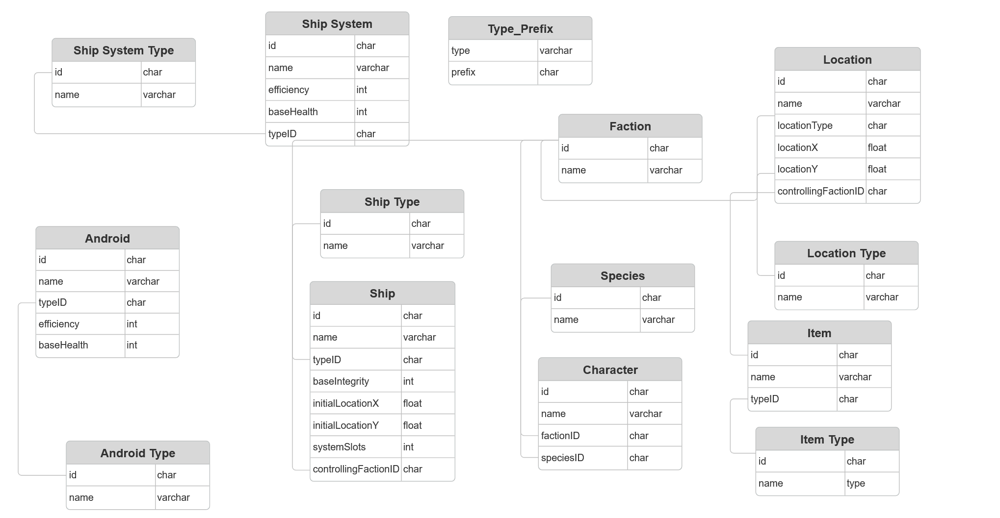

# Galactic Database

### By Emilio Roybal

This is a database management app that allows the user to build their own galaxy, including the planets, nebulae, asteroids, ships, species, items, and androids that inhabit it.

## Installation

To install this app, ensure you have Docker installed on your system. Then, open a terminal in this directory and type:

```docker-compose up```

This will initialize the database (port 543), the backend api (port 3000), and the frontend server (port 5173). Making modifications to the database is best done on the frontend application so navigate to the port with your desired browser to access it.

## Frontend Application Use

The application consists of a single page where data in the database can be read, created, modified, or deleted. The different types of data is on the left of the screen (i.e. Android, Faction, etc.). Click on the tab for the data type you want to modify.

Once a tab is selected, simply right click in the empty space next to the tabs to create a new element. You will be prompted to enter information about that element. Click "Submit" when you are done.

If you want to modify an element, simply click on it in the main list to the right of the tabs and it will populate in the right viewport. Change any data you desire and hit "Submit" to save the changes to the database.


## Database Design (ERD)

The database is divided into 14 tables. These tables are built in the following way:



